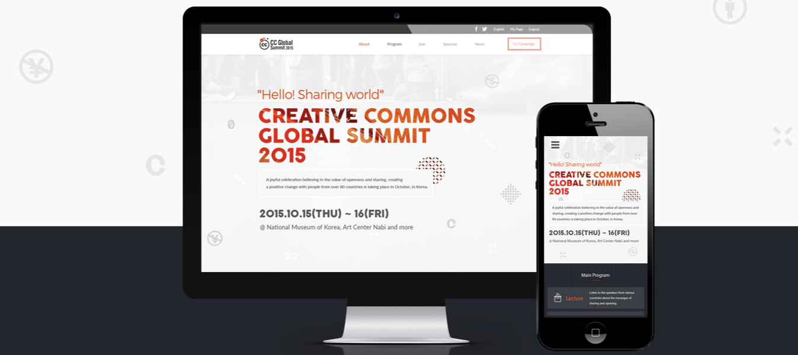

# Coding School

> HTML/CSS & JavaScript capstone project - from Microverse

## Built With

- HTML
- CSS
- JAVASCRIPT
- SCSS

## Getting Started

**To get a local copy up and running follow these simple example steps.**

To get a local copy up and running follow these simple example steps.

### Prerequisites

- Node
- Git
- Code Editor

### Setup

- Clone the repository
- Change directory into the project folder
- Open project with text editor to view changes

### Install

- Install dev dependencies
- If you are using vscode text editor, you can install [Live Sass Compiler](https://marketplace.visualstudio.com/items?itemName=ritwickdey.live-sass)
  - Then update your location of SCSS main file in `vscode` > `settings.json` file.
  ```
  "liveSassCompile.settings.formats": [
    {
      "format": "expanded",
      "extensionName": ".css",
      "savePath": "/dist/css"
    }
  ],
  ```
- Please make sure you are compiling scss to see the styles working

- Run the code using [live server](https://www.google.com/search?client=safari&rls=en&q=live+server&ie=UTF-8&oe=UTF-8)

## Deployment

Webpage has been deployed to github pages

## Live Demo

[Live Demo Link](https://learnwithalfred.github.io/alfred-code-college/)

## Author

👤 **Alfred Boateng**

- GitHub: [@learnwithalfred](https://github.com/learnwithalfred)
- Twitter: [@kb_alfred](https://twitter.com/kb_alfred)
- LinkedIn: [Alfred Boateng](https://www.linkedin.com/in/alfred-boateng-704670138/)

## 🤝 Contributing

Contributions, issues, and feature requests are welcome!

Feel free to check the [issues page](../../issues/).

## Show your support

Give a ⭐️ if you like this project!

## Acknowledgments

- Project Original design idea by [Cindy Shin in Behance](https://creativecommons.org/licenses/by-nc/4.0/)
- Inspiration from [Microverse Bootcamp](https://www.microverse.org)

## 📝 License

This project is [MIT](/LICENSE) licensed.
